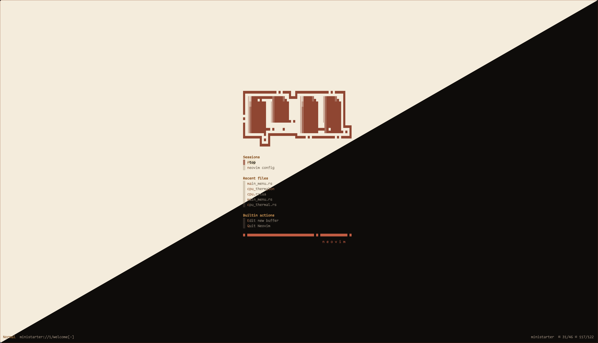
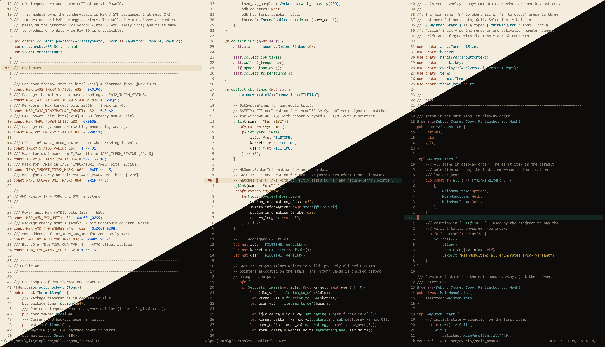
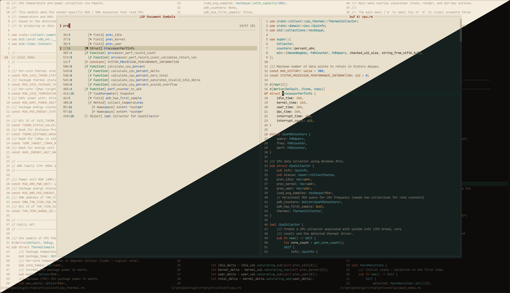

# Ferric

A metallurgy-inspired colorscheme for [Neovim](https://neovim.io) inspired by
the colors of the **Rust** programming language and the chemistry of iron
oxidation. Ships with paired **dark** and **light** palettes.

<details>
  <summary>📸 Click to View Screenshots</summary>
  <p><em>Each image is split diagonally — light theme in the upper-left half,
  dark theme in the lower-right half.</em></p>
  
  <br>
  
  <br>
  
</details>

## The Vision

**Ferric** draws from the **forge** — iron oxide, copper patina, heated metal,
and cobalt. The result is a theme that feels industrial, precise, and alive —
like staring into a blacksmith's workshop where every tool glows at a different
temperature.

The name comes from *ferric* (Fe³⁺) — iron in its oxidized state. Rust.

## Dark Palette

### Syntax

| Role        | Dark                                                        | Light                                                       |
| ----------- | ----------------------------------------------------------- | ----------------------------------------------------------- |
| Keywords    |  `#c15c42` |  `#8f4632` |
| Functions   |  `#5aaa88` |  `#036836` |
| Strings     |  `#c8a040` |  `#6a4c08` |
| Numbers     |  `#6a88b0` |  `#2a4a78` |
| Types       |  `#5a98a0` |  `#066679` |
| Constants   |  `#a76d4b` |  `#8c5634` |
| Preprocessor|  `#a16a89` |  `#8a4870` |
| Builtins    |  `#a16a89` |  `#8a4870` |
| Properties  |  `#948576` |  `#6a5e50` |
| Operators   |  `#6c7e75` |  `#656d68` |
| Comments    |  `#8a8073` |  `#726554` |
| Text        |  `#d0c8b8` |  `#1f1a12` |
| UI accent   |  `#c08c50` |  `#8a5424` |

### UI Surfaces

| Role             | Dark                                                        | Light                                                       |
| ---------------- | ----------------------------------------------------------- | ----------------------------------------------------------- |
| Background       |  `#0e0c0a` |  `#f4ecdc` |
| Tab bar          |  `#161210` |  `#ebe2cc` |
| Floats / popups  |  `#16201e` |  `#e8e0cc` |
| Float borders    |  `#3a4240` |  `#c0b596` |
| Scrollbar        |  `#1a2824` |  `#d8cdb4` |
| Selection (menu) |  `#1e3830` |  `#cdc4a8` |
| Color column     |  `#282220` |  `#e0d4ba` |
| Cursor line      |  `#142420` |  `#ece1c8` |
| Visual selection |  `#3c2a1e` |  `#e6d4b4` |
| Line numbers     |  `#8a7669` |  `#7e6848` |
| Muted text       |  `#82796f` |  `#746a5a` |
| Ghost text       |  `#484040` |  `#b0a48e` |

### Diagnostics

| Role    | Swatch                                                      | Light                                                       |
| ------- | ----------------------------------------------------------- | ----------------------------------------------------------- |
| Error   |  `#c15c42` |  `#8f4632` |
| Warning |  `#c8a040` |  `#6a4c08` |
| Info    |  `#6a88b0` |  `#2a4a78` |
| Hint    |  `#5a98a0` |  `#066679` |
| Ok      |  `#5aaa88` |  `#036836` |

### Git / Diff

| Role           | Dark                                                        | Light                                                       |
| -------------- | ----------------------------------------------------------- | ----------------------------------------------------------- |
| Added          |  `#5aaa88` |  `#036836` |
| Changed        |  `#c8a040` |  `#6a4c08` |
| Deleted        |  `#ca5546` |  `#a04030` |
| Diff add bg    |  `#204838` |  `#cce4d4` |
| Diff change bg |  `#1a3838` |  `#c4dcd8` |
| Diff delete bg |  `#5a2020` |  `#f4ccc0` |

### Terminal

| Role           | Dark                                                        | Light                                                       |
| -------------- | ----------------------------------------------------------- | ----------------------------------------------------------- |
| Black          |  `#0e0c0a` |  `#1f1a12` |
| Red            |  `#ca5546` |  `#a04030` |
| Green          |  `#5aaa88` |  `#036836` |
| Yellow         |  `#c8a040` |  `#6a4c08` |
| Blue           |  `#6a88b0` |  `#2a4a78` |
| Magenta        |  `#a16a89` |  `#8a4870` |
| Cyan           |  `#5a98a0` |  `#066679` |
| White          |  `#d0c8b8` |  `#ebe2cc` |
| Bright Black   |  `#8a8073` |  `#6a5e50` |
| Bright Red     |  `#d87068` |  `#753929` |
| Bright Green   |  `#80c8a8` |  `#00572b` |
| Bright Yellow  |  `#d8b860` |  `#614507` |
| Bright Blue    |  `#8aa8c8` |  `#1a3a6a` |
| Bright Magenta |  `#b888a0` |  `#6c3858` |
| Bright Cyan    |  `#80b8b0` |  `#005566` |
| Bright White   |  `#e8e0d0` |  `#fcf6e2` |

## Installation

### [lazy.nvim](https://github.com/folke/lazy.nvim)

```lua
{
  "freddiehaddad/ferric.nvim",
  lazy = false,
  priority = 1000,
  config = function()
    vim.cmd.colorscheme("ferric")
  end,
}
```

### vim.pack

```lua
vim.pack.add({ "https://github.com/freddiehaddad/ferric.nvim" })
-- vim.cmd.background("light")
vim.cmd.colorscheme("ferric")
```

### Manual

Clone this repository into your Neovim packages directory:

```sh
git clone https://github.com/freddiehaddad/ferric.nvim \
  ~/.local/share/nvim/site/pack/plugins/start/ferric.nvim
```

Then add to your config:

```lua
vim.cmd.colorscheme("ferric")
```

## Configuration

Ferric can be configured before loading the colorscheme. The defaults are:

```lua
require("ferric").setup({
  terminal_colors = true,
  palette_overrides = {},
  overrides = {},
})

vim.cmd.colorscheme("ferric")
```

## Switching Between Dark and Light

Ferric selects its palette from `vim.o.background`. Set it before
(or alongside) `:colorscheme` to pick a mode:

```lua
vim.o.background = "light"  -- or "dark" (default)
vim.cmd.colorscheme("ferric")
```

`palette_overrides` are applied on top of whichever palette is active and
follow you across mode switches.

To track your system or terminal preference, re-source the colorscheme
whenever `background` changes:

```lua
vim.api.nvim_create_autocmd("OptionSet", {
  pattern = "background",
  callback = function()
    if vim.g.colors_name == "ferric" then
      vim.cmd.colorscheme("ferric")
    end
  end,
})
```

The palette tables themselves are exposed under `ferric.palettes`:

```lua
local dark = require("ferric.palettes.dark")
local light = require("ferric.palettes.light")
```

## Recommended Font Setup

Pair with **[Comic Code](https://tosche.net/fonts/comic-code)** monospaced font
for the full aesthetic or one of the free alternatives:

- [Comic Mono](https://github.com/dtinth/comic-mono-font)
- [Serious Shanns](https://github.com/kaBeech/serious-shanns)

## License

[MIT](LICENSE)
